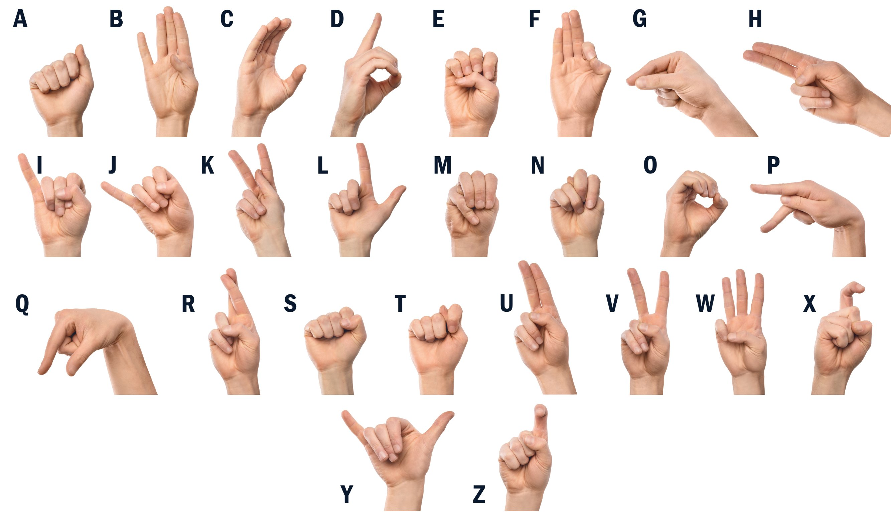

# Sign Language Detector

In this repository you can find several scripts and a Notebook to
collect data and train a model to predict Sign Language, of course
it can be something else, as along as you use your hands. In order 
to do this, you have to collect the data with the **SignsData.py**
and then load the data in the notebook **TrainModel.ipynb** and 
finally train the model. 

After having trained the model, you can use the **SignsLanguage.py**
to display the camera and test the model.

It is important to recall that, the quality of the data is very important,
since a person with perfect sign language is more likely to provide better
quality data.

